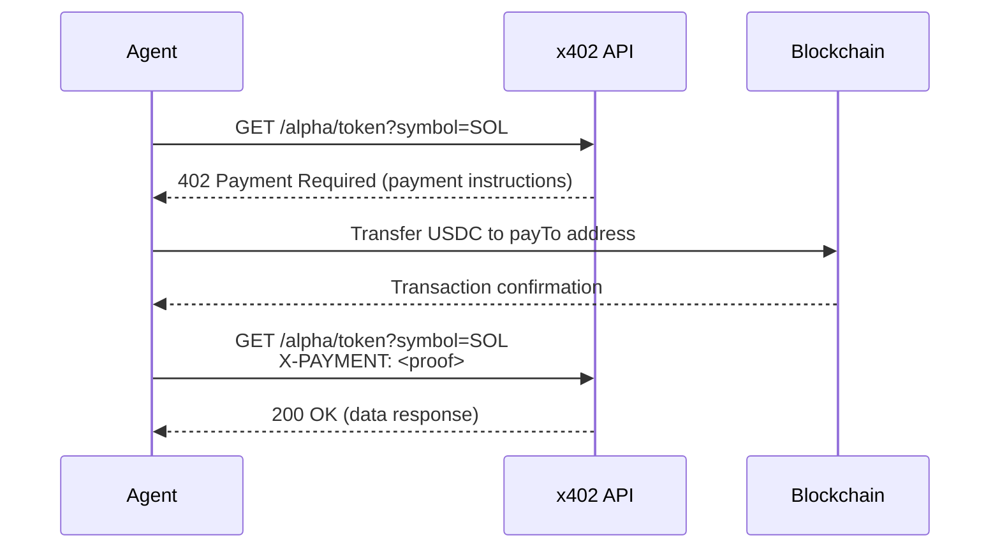

# Alpha Research API

> Trading intelligence for AI agents. Pay-per-use via x402 micropayments on Base.

Alpha Research API delivers AI-powered market intelligence through five endpoints — token analysis, trending detection, X/Twitter sentiment, neural search, and deep research — all accessible via USDC micropayments on Base, Ethereum, and Solana. No API keys. No subscriptions. Just pay and receive.

## Endpoints

| Endpoint | Price | What You Get |
|---|---|---|
| `/alpha/token` | $0.02 USDC | Price, volume, market cap + AI trading signals for any token |
| `/alpha/trending` | $0.02 USDC | Top trending tokens + AI narrative detection |
| `/alpha/sentiment` | $0.08 USDC | X/Twitter sentiment analysis (10 tweets) with bull/bear scoring |
| `/alpha/search` | $0.03 USDC | Neural search via Exa + AI summary with sources |
| `/alpha/deep` | $0.15 USDC | Full research: Exa + Firecrawl + Claude + X sentiment combined |

**Optional add-on:** Append `?twitter=true` to `/alpha/token` or `/alpha/trending` for X/Twitter data (+$0.05 USDC).

## Quick Start

### Using curl (manual x402 flow)

```bash
# Step 1: Hit the endpoint — you get a 402 with payment details
curl -i https://x402.911fund.io/alpha/token?symbol=SOL

# Response: HTTP 402 Payment Required
# Body includes: amount, recipient address, network, facilitator URL

# Step 2: Sign payment with your wallet, then retry with payment header
curl -H "X-PAYMENT: <signed_payment_payload>" \
  https://x402.911fund.io/alpha/token?symbol=SOL
```

### Using @x402/fetch (recommended for TypeScript)

```typescript
import { createX402Fetch } from "@x402/fetch";
import { createWalletClient, http } from "viem";
import { base } from "viem/chains";
import { privateKeyToAccount } from "viem/accounts";

const account = privateKeyToAccount(process.env.PRIVATE_KEY as `0x${string}`);
const walletClient = createWalletClient({
  account,
  chain: base,
  transport: http(),
});

const x402Fetch = createX402Fetch(walletClient);

// Token analysis — $0.02
const res = await x402Fetch("https://x402.911fund.io/alpha/token?symbol=SOL");
const data = await res.json();
console.log(data);
```

### Using Python

```python
import requests

# Step 1: Get payment requirements (402 response)
response = requests.get("https://x402.911fund.io/alpha/token?symbol=ETH")
print(response.status_code)  # 402
print(response.json())       # Payment instructions

# Step 2: After signing payment on-chain, retry with header
headers = {"X-Payment-Proof": "<your_transaction_signature>"}
response = requests.get(
    "https://x402.911fund.io/alpha/token?symbol=ETH",
    headers=headers
)
print(response.json())  # Token analysis data
```

See [`examples/`](./examples) for complete runnable code.

## Endpoint Details

### GET /alpha/token — Token Analysis

Get price, volume, market cap, and AI-generated trading signals for any token.

**Parameters:**

| Param | Required | Description |
|---|---|---|
| `symbol` | Yes* | Token symbol (e.g., `SOL`, `ETH`, `WIF`) |
| `address` | Yes* | Contract address (alternative to symbol) |
| `token` | Yes* | Alias for `address` or `symbol` |
| `chain` | No | Chain for lookup: `base`, `ethereum`, `solana` (default: `base`) |
| `twitter` | No | Add X/Twitter sentiment data (+$0.05 USDC) |

*Provide one of `symbol`, `address`, or `token`.

**Example requests:**

```
GET /alpha/token?symbol=SOL
GET /alpha/token?address=0x532f27101965dd16442E59d40670FaF5eBB142E4&chain=base
GET /alpha/token?symbol=WIF&twitter=true
```

**Response:**

```json
{
  "query": {
    "symbol": "SOL",
    "chain": "base",
    "includeTwitter": false
  },
  "data": {
    "dexscreener": {
      "price": 142.50,
      "volume24h": 3200000000,
      "priceChange24h": 5.2
    },
    "coingecko": {
      "name": "Solana",
      "price": 142.50,
      "volume24h": 3200000000,
      "marketCap": 68000000000,
      "priceChange24h": 5.2
    },
    "grokAnalysis": "BULLISH — Strong volume surge with accumulation pattern..."
  },
  "payment": {
    "chain": "base",
    "txHash": "0x...",
    "amount": 0.02,
    "verified": true
  },
  "timestamp": "2026-02-07T12:00:00.000Z"
}
```

When `twitter=true`, the response includes an additional `twitter` field:

```json
{
  "twitter": {
    "recentTweets": 10,
    "totalEngagement": 4520,
    "samples": [
      { "text": "...", "likes": 120, "retweets": 45 }
    ]
  }
}
```

---

### GET /alpha/trending — Market Movers

Top trending tokens with volume analysis and AI narrative detection.

**Parameters:**

| Param | Required | Description |
|---|---|---|
| `category` | No | Filter by category |
| `limit` | No | Number of results |
| `twitter` | No | Add X/Twitter mentions (+$0.05 USDC) |

**Example requests:**

```
GET /alpha/trending
GET /alpha/trending?twitter=true
GET /alpha/trending?limit=5
```

**Response:**

```json
{
  "query": {
    "includeTwitter": false
  },
  "data": {
    "coingecko": [
      {
        "symbol": "VIRTUAL",
        "price": 1.82,
        "volumeChange": 340
      }
    ],
    "narrativeSummary": "AI and agent tokens dominating today momentum..."
  },
  "payment": { "chain": "base", "txHash": "0x...", "amount": 0.02, "verified": true },
  "timestamp": "2026-02-07T12:00:00.000Z"
}
```

---

### GET /alpha/sentiment — X/Twitter Analysis

Analyze 10 recent tweets for bull/bear sentiment with AI-powered scoring.

**Parameters:**

| Param | Required | Description |
|---|---|---|
| `query` | Yes* | Search term — cashtag (`$WIF`), topic, or account (`@elikicha`) |
| `topic` | Yes* | Alias for `query` |
| `token` | Yes* | Alias for `query` |

*Provide one of `query`, `topic`, or `token`.

**Example requests:**

```
GET /alpha/sentiment?query=$WIF
GET /alpha/sentiment?topic=Solana+ecosystem
GET /alpha/sentiment?token=ETH
```

**Response:**

```json
{
  "query": "$WIF",
  "data": {
    "tweetsAnalyzed": 10,
    "totalLikes": 2450,
    "totalRetweets": 680,
    "samples": [
      {
        "text": "...",
        "likes": 350,
        "retweets": 120
      }
    ],
    "sentimentAnalysis": "Overall BULLISH (7/10) — Strong community engagement..."
  },
  "payment": { "chain": "base", "txHash": "0x...", "amount": 0.08, "verified": true },
  "timestamp": "2026-02-07T12:00:00.000Z"
}
```

---

### GET /alpha/search — Quick Research

Neural search via Exa + AI summary. Fast, no X data — best for facts and research.

**Parameters:**

| Param | Required | Description |
|---|---|---|
| `query` | Yes* | Research query (e.g., `Jupiter DEX Solana`, `Eigenlayer restaking`) |
| `q` | Yes* | Alias for `query` |

*Provide either `query` or `q`.

**Example requests:**

```
GET /alpha/search?query=Jupiter+DEX+Solana
GET /alpha/search?q=Base+L2+TVL+growth
```

**Response:**

```json
{
  "query": "Jupiter DEX Solana",
  "data": {
    "exa": {
      "resultsFound": 8,
      "results": [
        { "url": "https://...", "title": "...", "snippet": "..." }
      ]
    },
    "summary": "Jupiter is the leading DEX aggregator on Solana..."
  },
  "payment": { "chain": "base", "txHash": "0x...", "amount": 0.03, "verified": true },
  "sourcesUsed": "exa",
  "timestamp": "2026-02-07T12:00:00.000Z"
}
```

---

### GET /alpha/deep — Full Research Suite

Everything combined: Exa search + Firecrawl scrape + Claude analysis + X sentiment. The most comprehensive endpoint.

**Parameters:**

| Param | Required | Description |
|---|---|---|
| `query` | Yes* | Research question (e.g., `Should I invest in Farcaster?`) |
| `topic` | Yes* | Alias for `query` |
| `token` | Yes* | Alias for `query` |
| `url` | Yes* | Specific URL to research |

*Provide at least one of `query`, `topic`, `token`, or `url`.

**Example requests:**

```
GET /alpha/deep?query=Should+I+invest+in+Farcaster
GET /alpha/deep?topic=Base+L2+growth+metrics+2026
GET /alpha/deep?url=https://example.com/article
```

**Response:**

```json
{
  "query": "Should I invest in Farcaster?",
  "sources": ["exa", "firecrawl_search", "twitter"],
  "data": {
    "exa": {
      "resultsFound": 10,
      "results": ["..."]
    },
    "firecrawl": {
      "pagesScraped": 3,
      "content": ["..."]
    },
    "twitter": {
      "tweetsFound": 10,
      "totalEngagement": 3200,
      "topTweets": ["..."]
    }
  },
  "payment": { "chain": "base", "txHash": "0x...", "amount": 0.15, "verified": true },
  "timestamp": "2026-02-07T12:00:00.000Z"
}
```

**Note:** `/alpha/deep` may take up to 60 seconds due to multi-source analysis. Set your HTTP timeout accordingly.

---

## How x402 Payment Works

The x402 protocol replaces API keys with micropayments. Here is the flow:



### 1. Request Without Payment

```
GET /alpha/token?symbol=SOL  ->  HTTP 402 Payment Required
```

The 402 response body contains payment instructions:

```json
{
  "x402Version": 1,
  "error": "Payment required",
  "accepts": [
    {
      "scheme": "exact",
      "network": "base",
      "maxAmountRequired": "20000",
      "resource": "https://x402.911fund.io/alpha/token",
      "description": "Pay with USDC on Base",
      "payTo": "0xd86F1F35d6B15fEBef2f4a4390b584D8a7deC0B6",
      "asset": "0x833589fCD6eDb6E08f4c7C32D4f71b54bdA02913"
    }
  ]
}
```

### 2. Make Payment On-Chain

Transfer the specified USDC amount to the `payTo` address on the specified network.

### 3. Retry With Payment Proof

Include the payment proof in your request header:

```
GET /alpha/token?symbol=SOL
X-PAYMENT: <payment_proof>
```

The `@x402/fetch` SDK handles steps 1-3 automatically.

### Supported Payment Chains

| Chain | USDC Contract | Receiver | Confirmation Time |
|---|---|---|---|
| **Base** | `0x833589fCD6eDb6E08f4c7C32D4f71b54bdA02913` | `0xd86F1F35d6B15fEBef2f4a4390b584D8a7deC0B6` | ~2-3 seconds |
| **Ethereum** | `0xA0b86991c6218b36c1d19D4a2e9Eb0cE3606eB48` | `0xd86F1F35d6B15fEBef2f4a4390b584D8a7deC0B6` | ~12-15 seconds |
| **Solana** | `EPjFWdd5AufqSSqeM2qN1xzybapC8G4wEGGkZwyTDt1v` | `CtbPTTFMRfULUMz7DjPDRCKXVSBEcAEXeTUq4n7fSFuf` | ~400ms |

To pay on a specific chain, add `?chain=solana` (or `base`, `ethereum`) to your request.

### Payment Notes

- Each transaction can only be used once (replay protection)
- Transactions expire after 1 hour
- Check `/health` before making paid requests to verify the API is operational
- The `@x402/fetch` SDK handles payment construction and retry automatically

---

## Error Reference

| Status | Meaning | Action |
|---|---|---|
| `402` | Payment required | Follow the payment flow above |
| `400` | Bad request (missing/invalid params) | Check required parameters for the endpoint |
| `429` | Rate limited (30 req/min per IP) | Wait and retry |
| `500` | Upstream service error | Retry after a brief delay |

---

## Network & Payment Info

| Detail | Value |
|---|---|
| **Network** | Base (eip155:8453), Ethereum (eip155:1), Solana |
| **Token** | USDC |
| **Protocol** | x402 (HTTP 402 Payment Required) |
| **Facilitator** | Coinbase CDP |
| **Settlement** | Direct to wallet — no intermediary |
| **Rate Limit** | 30 requests/minute per IP |

## Machine-Readable Discovery

Agents can programmatically discover all endpoints, pricing, and chain configuration:

```
GET https://x402.911fund.io/.well-known/x402.json
```

A reference copy is available in this repo at [`.well-known/x402.json`](./.well-known/x402.json).
Always prefer the live version for the most current data.

## Stats & Health

```
GET https://x402.911fund.io/health
GET https://x402.911fund.io/stats
```

## Links

- **API:** https://x402.911fund.io
- **x402 Protocol:** https://x402.org
- **x402 Docs:** https://docs.cdp.coinbase.com/x402
- **@x402/fetch SDK:** https://github.com/coinbase/x402

## Built by

[911Fund Studio](https://911fund.io) — Building autonomous AI agent infrastructure.

## License

MIT

## Changelog

*No changes yet.*
